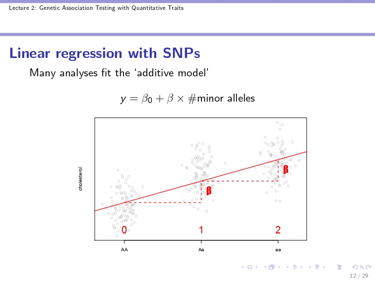

```{r setup, include=FALSE}
knitr::opts_chunk$set(echo = TRUE, eval = TRUE, warning = FALSE, message = FALSE)
knitr::opts_knit$set(root.dir = '~/RSV/data/post-imp/Assoc')
```

```{r Packages}
  library(dplyr)
  library(data.table)
  library(ggplot2)
  library(qqman)
  library(ggrepel) 
  library(tidyr)
  library(tidylog)
  library(stringi)
  library(janitor)
  library(stringr)
  library(RColorBrewer)
```

### Concatenation

Concatenate separate chromosome files from imputation server back into single merged file. Script utilises bcftools.

```{bash}
# Call concatenation script
bash concat.sh
```

### QC imputed SNPs

Re-check previous thresholds

```{bash PLINK set up and QC}

#Convert VCF to plink2 pfile

plink2 --vcf RSV_imputed.vcf.gz --geno 0.1 --mind 0.1 --make-pgen --out RSV_imp_QC
plink2 --pfile RSV_imp_QC --geno 0.05 --mind 0.05 --maf 0.01 --make-pgen --out RSV_imp_QC
#SNPs missing from 5% of population MAF <5 %
#So out of 340 the SNPs would have to be in 12 people
#10% cut off is probably better for assoc analysis in 34 people

#Convert back to bfile
#Plink2 pmerge function is still under development

plink2 --pfile RSV_imp_QC --geno 0.05 --mind 0.05 --maf 0.01 --make-bed --out RSV_imp_QC

```

**RSV post-imputation results:**

-   No variants removed after first QC round

-   25531828 variants removed due to allele frequency threshold(s)\
    8,917,131 variants remaining after main filters

```{bash Run Ethnicity Script}
# Script to check ethnicity data against 1000 Genomes
bash ancestry_check_38.sh

```

```{bash Filter IDs}
# Just keep our case/control study samples for now
plink2 --pfile RSV_imp_QC --keep study_samples.txt --make-pgen --out RSV_Oxford
# 318 samples

# Convert plink 1 version
plink2 --pfile RSV_Oxford --make-bed --out RSV_Oxford
```

### PCA

-   Use a PCA to account for population structure in data

-   Check ancestry first by plotting PCA and colour coding by ethnicity

-   Can also merge with public population databases

-   Include PCA's as covariates in association model

-   Need to prune for LD and sibling pairs (IBD)

```{bash sib check}

# Requires 1.9
plink --bfile RSV_Oxford --genome --missing --out RSV_Oxford_sib

# Remove one sample from each pair with pi-hat (% IBD) above threshold (0.1875 below):
awk '{if ($10 >= 0.1875) {print $1, $2}}' RSV_Oxford_sib.genome | uniq > RSV_Oxford_sib.outliers.txt 
awk '{if ($10 >= 0.1875) {print $1, $2, $3, $4, $10}}' RSV_Oxford_sib.genome | uniq > RSV_Oxford_sib.report.txt 
wc -l RSV_Oxford_sib.outliers.txt

# Prune samples from study when calculating PCD
# Check meta data too
```

```{bash}
awk '{if ($10 >= 0.1875) {print $3, $4}}' RSV_Oxford_sib.genome | uniq > RSV_Oxford_sib.outliers.txt

# Filter in plink
plink2 \
--bfile RSV_Oxford \
--remove RSV_Oxford_sib.outliers.txt \
--make-bed \
--out RSV_Oxford_nosib
```

```{bash Run PCA}
# PCA prep LD prune and IBD check

plink2 --bfile RSV_Oxford_nosib --pca 


#plink2 --pfile RSV_Oxford --pca 
```

Run PCA in R. There is also the PCA plotting script from the ancestry analysis

```{r Set up PCA in R, eval=TRUE}
pca <- fread("plink2.eigenvec")
eigenval <- fread("plink2.eigenval")
# Remove hashtag manually in IID in txt file, or next time try '#'

covar <- fread("covar.txt") #"covar_all.txt" 
pca_covar <- left_join(pca, covar, by = "IID") 

# matched 318 rows :)

pca_covar$Sex <- as.factor(pca_covar$Sex)
levels(pca_covar$Sex) <- c("Male", "Female")

#ooh could compare new pcs.y with old pcs.x
pca_covar %>% ggplot(aes(PC2.x, PC2.y)) + geom_point()
# A couple of outliers but no major difference

# Plot PCA coloured by Sex
pca1 <- pca_covar %>%
  ggplot(aes(PC1, PC2, color = Sex)) +
  geom_point() +
  labs(x = "PC1", y = "PC2", title = "PCA by Sex") + 
  theme_light()
pca1

# Rearrange table
pca_covar <- pca_covar[,c(1:2,13:16,7:12,17:19)]
names(pca_covar) <- str_remove_all(names(pca_covar), ".y")


# Calculate Percentage variance explained
pve <-
  data.frame(PC = 1:10, pve = round(eigenval / sum(eigenval) * 100, 2))

colnames(pve) <- c("PC", "pve")
pve$PC <- as.factor(pve$PC)

p <- 
  pve %>% ggplot(aes(x = PC, y = pve, fill = PC)) +
  geom_col() +
  theme_light() +
  labs(x = "Principle Component",
       y = "Percentage Varience Explained")

#Elbow at PC4 #Use first 4 PCAs as Covars

# Make new covar file to use
write.table(pca_covar, file = "pca_covar2.txt", row.names = F, quote = F, sep = "\t")


# Case control pheno
pheno <- fread("pheno.txt")

pheno2 <- pheno %>% 
  mutate(RSV = ifelse(is.na(RESV_total_score) == TRUE, 1,2))

write.table(pheno2, file = "pheno2.txt", row.names = F, quote = F, sep = "\t")

his <-
  pheno2 %>%
  ggplot(aes(x=RESV_total_score)) +
  geom_histogram(colour = "#AA98A9", fill = "#E0B0FF", bins = 20) +
  theme_light() +
  xlab("ReSVinet score")
his


# PCA plots -----------------------------------------------------------------

pdf(pdf(file =(paste(plot_dir,"pca_sex.pdf",sep =""))))
pca1
dev.off()

pdf(pdf(file =(paste(plot_dir,"pva.pdf",sep =""))))
p
dev.off()

pdf(pdf(file =(paste(plot_dir,"RESV_his.pdf",sep =""))))
his
dev.off()

```

### Conclusions

-   Include first 4 PC's as covariates in association analysis

### Association Analysis

-   General linear association model (GLM): pheno-name RESV_total_score

-   Covariates to include: PC1-4, Sex, has_pre_ex_con, baseline_age_at_visit\
    <https://www.cog-genomics.org/plink/2.0/assoc>

```{bash Association Analysis}
#mkdir -p Assoc
plink2 --bfile RSV_Oxford_nosib --pheno pheno2.txt --pheno-name RESV_total_score --covar pca_covar2.txt --covar-name Sex, PC1, PC2, PC3, PC4, has_pre_ex_con, baseline_age_at_visit --covar-variance-standardize --glm --out nosib2
```

```{bash Case/Control Analysis}
plink2 --bfile RSV_Oxford_nosib --pheno pheno2.txt --pheno-name RSV  --covar pca_covar2.txt --covar-name Sex, PC1, PC2, PC3, PC4, has_pre_ex_con, baseline_age_at_visit --covar-variance-standardize --glm --out nosib
```

### Linear Regression

Plink2 fits generalised linear mixed effects model:

y = G𝛽 + C𝛽 + e

-   Where, y is our response variable - ReSVinet score

-   G is our genotype dosage matrix

-   C is our covariate matrix

-   e is the error standard error (or residual) of our model estimate

-   𝛽 are our model coefficients of determination. So, for each SNP we are modelling whether zero, one or two copies of an allele in our population, against our linear y variable, RSV severity.

-   Then test to see if there is a relationship, how strong the effect is, if it is signifcant



The null hypothesis is that there is no linear relationship. Therefore if;\
𝛃 = 0 the allele shows no relationship with our phenotype score\
𝛃 \> 0 the allele is associated with a more positive score\
𝛃 \< 0 the allele is associated with a more negative score

The significance of this relationship is then tested by calculating the T statistic:\
\
**t = b / SE**

-   **b** is the estimated value of linear slope or the coefficient of the predictor variable.

-   **SE~*b*~** represents the standard error of the coefficient estimation which can be estimated using the following formula:

    -   **SE = S / √N** Where S represents the standard deviation and N represents the total number of data points

If the p-value that corresponds to t is less than some threshold (e.g. α = .05); then we reject the null hypothesis and conclude that there is a statistically significant relationship between the predictor variable and the response variable

```{r Plot Assoc Results, eval = TRUE, cache=TRUE}


# RESV severity Assoc -----------------------------------------------------------
plot_dir <- c("~/RSV/data/post-imp/Assoc/plots/")
gwas2 <- fread("nosib2.RESV_total_score.glm.linear")

# Rename cols for qqman
colnames(gwas2) <- c("CHR", "BP", "SNP", "REF", "ALT", "A1","TEST","OBS_CT","BETA",        
                           "SE","T_STAT","P","ERRCODE")

gwas2 <-
  filter(gwas2, TEST == "ADD")#Keep just genetic testing


# top <- filter(gwas2, P <= 10e-5)

test <- gwas2 %>% filter(P <= 10e-2) %>% select(c("CHR", "BP", "SNP", "REF", "ALT", "P"))

test$SNP <- str_replace_all(test$SNP, ":", "_")


# write.table(top, file = "gwas2.txt", quote = F, row.names= F, sep = "\t")

write.table(test, file = "test.txt", quote = F, row.names= F, sep = "\t")


# Plot Manhattan
manhattan(gwas2, ylim = c(0, 8), cex = 0.6, cex.axis = 0.9, genomewideline = F, col = c("mediumseagreen", "darkolivegreen4"))

pdf(file =(paste(plot_dir,"manhattan_RESV2.pdf",sep ="")), paper = "a4r")
manhattan(gwas, ylim = c(0, 8), cex = 0.6, cex.axis = 0.9, genomewideline = F, col = c("mediumseagreen", "darkolivegreen4"))
dev.off()

# Inspect top snps: ------------------------------------------------------------
tophits <- filter(gwas, P < 10e-5)
head(tophits)
#Write top hits file 
write.table(tophits, file = "tophits2.txt", quote = F, row.names= F, sep = "\t")

tophits2 <- filter(gwas2, P < 10e-5)
write.table(tophits2, file = "tophits22.txt", quote = F, row.names= F, sep = "\t")


# Case control -----------------------------------------------------------------

case <- fread("nosib.RSV.glm.logistic.hybrid")
names(case) <- c("CHR", "BP", "SNP", "REF", "ALT", "A1", "FIRTH","TEST","OBS_CT","OR",        
                           "LOG(OR)_SE","Z_STAT","P","ERRCODE")

case <- filter(case, TEST == "ADD") 
case_tophits <- filter(case, P < 10e-5)

# pdf(file =(paste(plot_dir,"manhattan_RESV.pdf",sep ="")))
manhattan(case, ylim = c(0, 8), cex = 0.6, cex.axis = 0.9, genomewideline = F, col = c("mediumseagreen", "darkolivegreen4"))
# Much less sig, and is not suited to reflect a linear response to infection

```

```{bash CD14 association}
plink2 --bfile RSV_Oxford_nosib --chr 5 --from-bp 140630856 --to-bp 140634071 --pheno pheno2.txt --pheno-name RESV_total_score --covar pca_covar2.txt --covar-name Sex, PC1, PC2, PC3, PC4, has_pre_ex_con, baseline_age_at_visit --covar-variance-standardize --glm --out CD14
```

```{r CD14 results}

CD14 <- fread("CD14.RESV_total_score.glm.linear")
CD14 <- filter(CD14, TEST == "ADD")
# No sig results

```

```{bash}
# Prep for annotation
# cut in bash

cut -f 3 tophits22.txt > explore_hits.txt
sed -i 's/chr//g' explore_hits.txt
cut -d ':' -f 1,2 explore_hits.txt > explore_hits2.txt

# Updates - server did not work
```

```{r gtex}

gtex <- read.csv(file = "gtex.csv")
gtex <- drop_na(gtex) %>% filter(dbSNP != "none")
gtex$tissue <- rep("Lung", length(gtex$dbSNP))
gtex <- gtex[1:400,]
write.csv(gtex, file = "gtex_lung.csv", row.names = F, quote = F)

```
